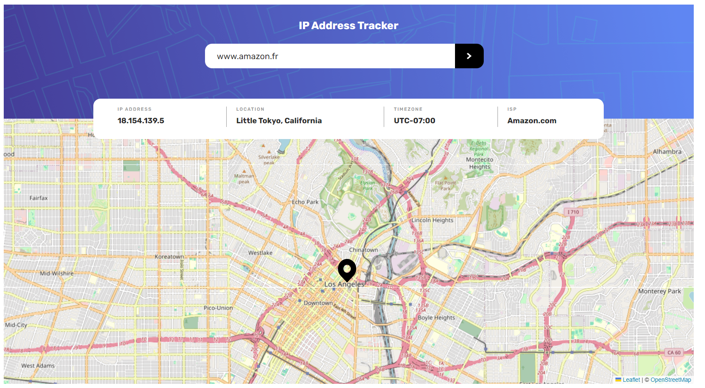

# Frontend Mentor - IP address tracker solution

This is a solution to the [IP address tracker challenge on Frontend Mentor](https://www.frontendmentor.io/challenges/ip-address-tracker-I8-0yYAH0). Frontend Mentor challenges help you improve your coding skills by building realistic projects. 

## Table of contents

- [Overview](#overview)
  - [The challenge](#the-challenge)
  - [Screenshot](#screenshot)
  - [Links](#links)
- [My process](#my-process)
  - [Built with](#built-with)
  - [What I learned](#what-i-learned)
  - [Continued development](#continued-development)
- [Author](#author)
- [Acknowledgments](#acknowledgments)

## Overview

### The challenge

Users should be able to:

- View the optimal layout for each page depending on their device's screen size
- See hover states for all interactive elements on the page
- See their own IP address on the map on the initial page load
- Search for any IP addresses or domains and see the key information and location

### Screenshot

### Links

- Solution URL: https://www.frontendmentor.io/solutions/responsive-design-using-standard-css-flexbox-js-vanilla-F8nIQJnSDy
- Live Site URL: https://akalabete.github.io/ip-adress-tracker-frontend-mentor-project/

## My process

### Built with

- Semantic HTML5 markup
- CSS custom properties
- Flexbox
- Mobile-first workflow

### What I learned

The asynchroneous and api usage were very interesting, it's always nice to learn new api / libraries.

### Continued development

possible rework using next.js and some tailwind. gotta think about it.

## Author

- Website - [LACOUR Alexandre](https://www.lacouralexandre.tech)
- Frontend Mentor - [@akalabete](https://www.frontendmentor.io/profile/yourusername)

## Acknowledgments

thanks frontend mentor for this exciting free challenge (wish there were more of them tbh ;) 
